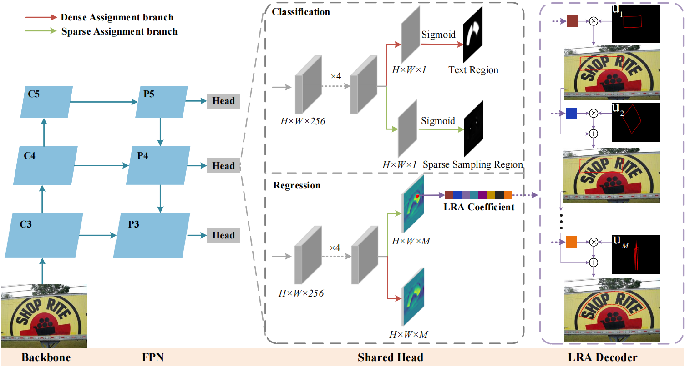

# <h1 align="center"> LRANet: Towards Accurate and Efficient Scene Text Detection with Low-Rank Approximation Network </h1> 

<div align="center">
    
</div>

This is the official implementation of Paper: [LRANet: Towards Accurate and Efficient Scene Text Detection with Low-Rank Approximation Network](https://arxiv.org/abs/2306.15142.pdf) (AAAI 2024 Oral).

## Environment
This implementation is based on mmocr-0.2.1, so please refer to it for detailed requirements. Our code has been test with Pytorch-1.8.1 + cuda11.1
We recommend using [Anaconda](https://www.anaconda.com/) to manage environments. Run the following commands to install dependencies.

Pytorch : [One Drive](https://1drv.ms/u/c/71ea5bbc72455b58/EfoJNNlOVmFPq7TzT24eTPEB1B3mDpOPfzUOSg67cC9iFg?e=OK5bWD)

torchvision : [One Drive](https://1drv.ms/u/c/71ea5bbc72455b58/ESdd8-ND5HBOutFCq318fEYByCzOcJD1IrRf1zcwCvI5OA?e=b582zr)
```
conda create -n lranet python=3.7 -y
conda activate lranet
#使用.whl文件安装pytorch和torchvision     ----hu yiwen
pip install torch-1.8.1+cu111-cp37-cp37m-linux_x86_64.whl
pip install torchvision-0.9.1+cu111-cp37-cp37m-linux_x86_64.whl
pip install mmcv-full==1.3.9 -f https://download.openmmlab.com/mmcv/dist/cu111/torch1.8.0/index.html
pip install mmdet==2.14.0
git clone https://github.com/open-mmlab/mmocr.git
cd mmocr
git checkout v0.2.1
pip install -e .
cd ..
git clone https://github.com/ychensu/LRANet
cd LRANet
pip install -r requirements.txt
python setup.py build develop

```

## Dataset

Please download TotalText, CTW1500, and SynText150k according to the guide provided by TPSNet: [README.md](https://github.com/Wei-ucas/TPSNet).


Please download and extract the above datasets into the `data` folder following the file structure below.
```
data
└─totaltext
  │ totaltext_train.json
  │ totaltext_test.json
  └─imgs
      ├─training
      └─test

```

## Train
```
PYTHONPATH=$(pwd) CUDA_VISIBLE_DEVICES=0  ./tools/dist_train.sh configs/lranet/lranet_totaltext_det.py work_dirs/totaltext_det 1
```

## Test
```
#测试多张图片并输出可视化结果，结果在results文件夹中
PYTHONPATH=$(pwd) python ./tools/det_test_imgs.py  ./data/totaltext/imgs/  ./data/totaltext/test_imgs_list.txt configs/lranet/lranet_totaltext_det.py work_dirs/totaltext_det/epoch_10.pth --out-dir ./results/totaltext_det/
```

## Evaluation
```
#测试原论文结果模型
PYTHONPATH=$(pwd) CUDA_VISIBLE_DEVICES=0 python tools/test.py configs/lranet/lranet_totaltext_det.py work_dirs/totaltext_det/final_totaltext.pth --eval hmean-iou
#测试复现模型
PYTHONPATH=$(pwd) CUDA_VISIBLE_DEVICES=0 python tools/test.py configs/lranet/lranet_totaltext_det.py work_dirs/totaltext_det/epoch_10.pth --eval hmean-iou
```


## Trained Model(原论文)
下载后放在./work_dirs/totaltext_det路径下

使用Total-Text数据集训练 : [One Drive](https://onedrive.live.com/?redeem=aHR0cHM6Ly8xZHJ2Lm1zL3UvYy81YWE2OWZiZTU4NDY0MDYxL0VZdmxkOXBEWUFGSnM2SERNNWFscWFjQlRpejVtWG5WZmxoQ1JiUFlmX0x1SXc%5FZT1rY3RBa3k&cid=5AA69FBE58464061&id=5AA69FBE58464061%21sda77e58b60434901b3a1c33396a5a9a7&parId=root&o=OneUp)

## Trained Model(复现)
下载后放在./work_dir/total_text路径下

使用Total-Text数据集训练 : [One Drive](https://1drv.ms/u/c/71ea5bbc72455b58/EaSlt59YAoFJmcBwiuDOEmUB3VtesaCFC3NwKmzAVYhuOA?e=SpCeZW)


## Acknowledgement
We sincerely thank [MMOCR](https://github.com/open-mmlab/mmocr), [ABCNet](https://github.com/aim-uofa/AdelaiDet/tree/master/configs/BAText), and [TPSNet](https://github.com/Wei-ucas/TPSNet) for their excellent works.
